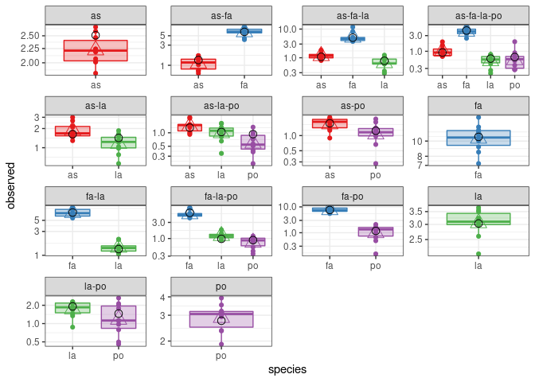
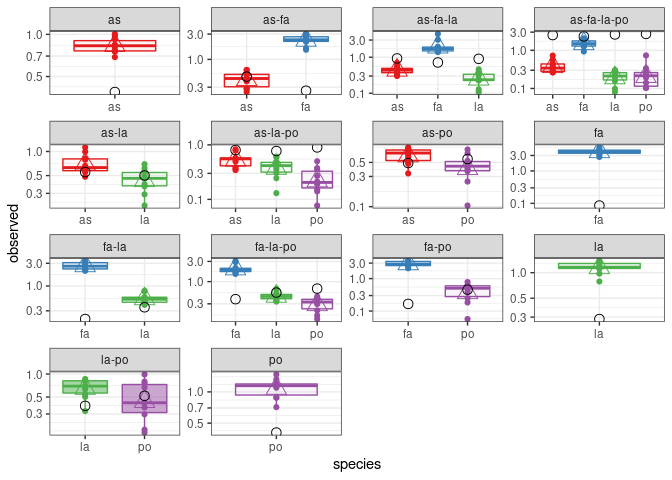

Test code
================

## Fitting the models

As detailed in the manuscript, we derive five nested versions of the
model:

-   *B* arbitrary, which can be selected using `model = "full"`
-   *B = D(d) + vw^T*, which can be selected using `model = "diag_vwt"`
-   *B = D(d) + vv^T*, which can be selected using `model = "diag_vvt"`
-   *B = D(d) + alpha 11^T*, which can be selected using
    `model = "diag_a11t"`

We can also choose between two goal functions, attempting to minimize
either the sum of squared deviations (OLS, selected using
`goal = "SSQ"`), or the weighted sum of the squared deviations (WLS,
selected using `goalf = "WLS"`).

Other options allow to :

-   `pars = "NULL` by default, the parameters are initialized with *B =
    I* for all models. The user can provide alternative parameters
    instead.
-   `skipEM = FALSE` skip the iterative algorithm and perform the
    numerical search directly.
-   `plot_results = TRUE` plot the results at the end of the
    calculation.

For example, to fit the data by Kuebbing et al. (2015), non-native
species, using OLS and the simplified model *B = D(d) + vw^T*, one can
invoke:

``` r
source("general.R")
res <- run_model(datafile = "../data/kuebbing_2015_non_natives.csv", # location of the data
          model = "diag_vwt", # one of "diag_a11t", "diag_vvt", "diag_vwt", or "full"
          goalf = "SSQ", # one of SSQ, WLS
          pars = NULL, # pre-computed parameters; otherwise use the identity matrix
          skipEM = FALSE, # skip the iterative algorithm
          plot_results = TRUE # plot the results as boxplots
          )
```

    ## [1] "iterative step 1 -> 67.0062462911419"
    ## [1] "iterative step 2 -> 58.1125868909348"
    ## [1] "iterative step 3 -> 52.831579796576"
    ## [1] "iterative step 4 -> 48.1614107930199"
    ## [1] "iterative step 5 -> 43.7510941997679"
    ## [1] "iterative step 6 -> 40.7931051934239"
    ## [1] "iterative step 7 -> 38.7693436324155"
    ## [1] "iterative step 8 -> 37.3940743308755"
    ## [1] "iterative step 9 -> 36.3404144951679"
    ## [1] "iterative step 10 -> 35.9586264383472"
    ## [1] "iterative step 11 -> 34.918386145092"
    ## [1] "iterative step 12 -> 34.495479516673"
    ## [1] "iterative step 13 -> 34.0632653666747"
    ## [1] "iterative step 14 -> 33.7667109953849"
    ## [1] "iterative step 15 -> 33.3999522502816"
    ## [1] "iterative step 16 -> 33.23408137218"
    ## [1] "iterative step 17 -> 32.9573872515676"
    ## [1] "iterative step 18 -> 32.7704882115572"
    ## [1] "iterative step 19 -> 32.5549861467456"
    ## [1] "iterative step 20 -> 32.3779777912159"
    ## [1] "iterative step 21 -> 32.2017947003788"
    ## [1] "iterative step 22 -> 32.0677438786954"
    ## [1] "iterative step 23 -> 32.0020931017848"
    ## [1] "iterative step 24 -> 31.9375212099102"
    ## [1] "iterative step 25 -> 31.7738898224771"
    ## [1] "numerical search"
    ## [1] 29.90851
    ## [1] 29.90851
    ## [1] 29.90851
    ## [1] 29.90851
    ## [1] 29.90851
    ## [1] 29.90851

<!-- -->

``` r
str(res)
```

    ## List of 8
    ##  $ data_name    : chr "kuebbing_2015_non_natives"
    ##  $ observed     : num [1:140, 1:4] 0 0 0 0 0 0 0 0 0 0 ...
    ##   ..- attr(*, "dimnames")=List of 2
    ##   .. ..$ : NULL
    ##   .. ..$ : chr [1:4] "as" "fa" "la" "po"
    ##  $ predicted    : num [1:140, 1:4] 0 0 0 0 0 0 0 0 0 0 ...
    ##   ..- attr(*, "dimnames")=List of 2
    ##   .. ..$ : NULL
    ##   .. ..$ : chr [1:4] "as" "fa" "la" "po"
    ##  $ variances    : num [1:140, 1:4] 0 0 0 0 0 0 0 0 0 0 ...
    ##   ..- attr(*, "dimnames")=List of 2
    ##   .. ..$ : NULL
    ##   .. ..$ : chr [1:4] "as" "fa" "la" "po"
    ##  $ B            : num [1:4, 1:4] 1.064 0.836 0.867 0.835 0.202 ...
    ##  $ pars         : num [1:12] 4.4 20.3 4.96 3.1 1.65 ...
    ##  $ goal_function: num 29.9
    ##  $ goal_type    : chr "SSQ"

## Out-of-fit predictions

The model can be fitted using part of the data, and then the parameters
used to predict the whole data set, including the data that was not used
to fit the model. To implement a simple Leave-One-Out approach, one can
call `run_model_LOO`, with an extra parameter, `LOO_row_num`. This is
the row number of the data to be excluded. All communities of the same
type will be excluded as well. For example, in the file
`kuebbing_2015_non_natives.csv`, row 22 contains a replicate of the
community `as + fa`. By selecting this row, all communities of the same
type are excluded from the fit.

When plotting, the out-of-fit prediction is reported using colored
boxplots, while the in-fit data is plotted in white:

``` r
source("general.R")
res <- run_model_LOO(datafile = "../data/kuebbing_2015_non_natives.csv", # location of the data
          model = "diag_vwt", # one of "diag_a11t", "diag_vvt", "diag_vwt", or "full"
          goalf = "WLS", # one of SSQ, WLS
          LOO_row_num = 22, # exclude all replicates of as + fa from the fit
          pars = NULL, # pre-computed parameters; otherwise use the identity matrix
          skipEM = FALSE, # skip the iterative algorithm
          plot_results = TRUE # plot the results as boxplots
          )
```

    ## [1] "iterative step 1 -> 621.808110694175"
    ## [1] "iterative step 2 -> 621.808110694175"
    ## [1] "iterative step 3 -> 599.913139473817"
    ## [1] "iterative step 4 -> 384.2634314538"
    ## [1] "iterative step 5 -> 357.417389231598"
    ## [1] "iterative step 6 -> 311.892906469798"
    ## [1] "iterative step 7 -> 311.892906469798"
    ## [1] "iterative step 8 -> 289.171194810318"
    ## [1] "iterative step 9 -> 285.761608937196"
    ## [1] "iterative step 10 -> 285.574791134673"
    ## [1] "iterative step 11 -> 285.574791134673"
    ## [1] "iterative step 12 -> 285.574791134673"
    ## [1] "iterative step 13 -> 285.574791134673"
    ## [1] "iterative step 14 -> 285.574791134673"
    ## [1] "iterative step 15 -> 285.574791134673"
    ## [1] "iterative step 16 -> 285.574791134673"
    ## [1] "iterative step 17 -> 285.574791134673"
    ## [1] "iterative step 18 -> 285.574791134673"
    ## [1] "iterative step 19 -> 285.574791134673"
    ## [1] "iterative step 20 -> 285.574791134673"
    ## [1] "iterative step 21 -> 285.574791134673"
    ## [1] "iterative step 22 -> 285.574791134673"
    ## [1] "iterative step 23 -> 285.574791134673"
    ## [1] "iterative step 24 -> 285.574791134673"
    ## [1] "iterative step 25 -> 285.574791134673"
    ## [1] "numerical search"
    ## [1] 260.4811
    ## [1] 260.4811
    ## [1] 260.4811
    ## [1] 260.4811
    ## [1] 260.4811
    ## [1] 260.4811

<!-- -->
